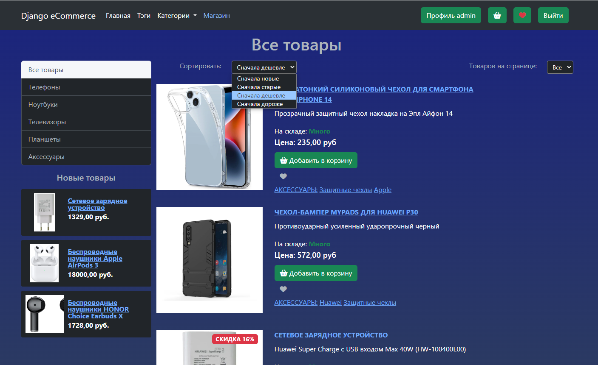

# Django E-commerce
Django-ecommerce - это pet-проект онлайн-магазина.  
Данный проект не предназначен для коммерческого использования. 

## Используемые инструменты и технологии:
- Python 3.12
- Django 4.2.3
- Redis
- Celery
- Docker, Docker Compose
- JavaScript, jQuery, Ajax
- SQLite
- HTML, CSS, Bootstrap 5

## Функции
### Пользовательские:
- Регистрация/авторизация пользователя
- Восстановление забытого пароля посредством email
- Поставить/убрать лайк к новости
- Написать/удалить комментарий к новости
- Добавить товар в корзину
- Добавить товар в список избранного
- Создать заказ на основе товаров в корзине
- Применение скидочного купона к корзине
- Просмотр и редактирование профиля
- Просмотр своих комментариев
- Просмотр своих заказов
- Изменение собственного пароля
- Возможность добавить несколько адресов для доставки и выбрать основной адрес
  
### Административные:
- Создание и редактирование товаров, категорий, тегов, пользователей и т.п.
- Создание и публикация новостей
- Модерирование комментариев (подтвердить, удалить, изменить)  
  
Все административные функции реализованы посредством стандартной административной панели Django
  
## О проекте
- В данном проекте frontend'у не уделялось особое внимание. В качестве большинства элементов были взяты готовые сниппеты, найденные в интернете и немного доработанные.
- Весь дизайн написан с минимальным количеством собственных стилей, используются базовые возможности Bootstrap 5.
- Дизайн сайта полностью адаптирован для различных размеров экрана, присутствует мобильная версия.  

- В backend большинство действий пользователя сопровождаются сообщениями, реализованными с помощью django messages.
- Корзина пользователя реализована в Django Сессиях. При выходе пользователя с сайта (logout) корзина сохраняется в базе данных. При авторизации пользователя, при наличии, корзина подгружается из базы данных.
- Профили пользователя реализованы собственной моделью. При регистрации пользователя с помощью reciever создается модель Профиль на основе модели User (django). При редактировании профиля данные в модели users также изменяются.
- При создании заказа на почту покупателю приходит письмо, отправка которого реализована посредством Celery.
- Для просмотра фотографий товара используется написанный мной скрипт галереи на jQuery.
- Для изменения количества товара в корзине используется jQuery и Ajax.
- Для добавления товара в корзину/список избранного используется Ajax.
- Для лайков также используется ajax и jquery.

## Запуск проекта с тестовыми данными (заполненные товары в SQLite)
1. Выполнить клонирование репозитория ```git clone <>```.
2. Зайти в папку проекта и создать файл ```.env.dev``` для переменных окружения.
3. В файл ```.env.dev``` добавить:  
```
DJANGO_DEBUG=1
DJANGO_ALLOWED_HOSTS=localhost 127.0.0.1 [::1]
DJANGO_SECRET_KEY= <secret_key>
DJANGO_EMAIL_HOST = <smtp_server>
DJANGO_EMAIL_PORT = <smtp_port>
DJANGO_EMAIL_HOST_USER = <smtp_email_host_user>
DJANGO_EMAIL_HOST_PASSWORD = <smtp_user_password>
DJANGO_DEFAULT_FROM_EMAIL = <smtp_email_from>
```
где ```<...>``` подставить собственные значения.  
4. Из папки проекта выполнить в терминале команду ```docker compose up```
5. Сайт будет доступен по адресу ```http://127.0.0.1:8000/```
6. Логин/Пароль demo Администратора:

```
login: admin
password: adminadmin
```


## Запуск "чистого" проекта без тестовой базы данных
1. Выполнить клонирование репозитория ```git clone <>```.
2. Зайти в папку проекта и создать файл ```.env.dev``` для переменных окружения.
3. В файл ```.env.dev``` добавить:  
```
DJANGO_DEBUG=1
DJANGO_ALLOWED_HOSTS=localhost 127.0.0.1 [::1]
DJANGO_SECRET_KEY= <secret_key>
DJANGO_EMAIL_HOST = <smtp_server>
DJANGO_EMAIL_PORT = <smtp_port>
DJANGO_EMAIL_HOST_USER = <smtp_email_host_user>
DJANGO_EMAIL_HOST_PASSWORD = <smtp_user_password>
DJANGO_DEFAULT_FROM_EMAIL = <smtp_email_from>
```
где ```<...>``` подставить собственные значения.
4. Удалить файл ```db.sqlite3```
5. Создать миграции ```python manange.py makemigrations users, order, shop, blog```
6. Применить миграции ```python manange.py migrate```
7. Из папки проекта выполнить в терминале команду ```docker compose up```
8. Сайт будет доступен по адресу ```http://127.0.0.1:8000/```

## Скриншоты проекта

*При использовании расширения для браузера GoFullPageScreenshot некорректно отображается background сайта на скриншотах. При просмотре сайта background отображается корректно, единым градиентом
```
body {
  background: linear-gradient(to bottom, #1a237e, #232f70, #2b3a62);
  background-repeat: no-repeat;
  background-attachment: fixed;
  background-size: cover;
}
```

<details>
  <summary>Главная страница сайта (неавторизованный пользователь)</summary>

  
</details>
<details>
  <summary>Главная страница сайта (авторизованный пользователь)</summary>
  
  
</details>

<details>
  <summary>Регистрация пользователя</summary>
  
  
</details>

<details>
  <summary>Новость подробно</summary>
  
  
</details>

<details>
  <summary>Теги</summary>
  Для разноцветных кнопок применен django filter написанный мною
  
  
</details>

<details>
  <summary>Все категории</summary>
  Для разноцветных кнопок применен django filter написанный мною
  
  
</details>

<details>
  <summary>Магазин</summary>
  

  
Фильтры
      

  
Полная страница с 10 товарами


</details>

<details>
  <summary>Товар</summary>
  
  

  
</details>

<details>
  <summary>Просмотр фото товара (JavaScript)</summary>
  
  

  
</details>


<details>
  <summary>Корзина</summary>
  

  
  Примененный купон


</details>

<details>
  <summary>Список избранного</summary>
  

</details>

<details>
  <summary>Профиль пользователя</summary>
  

</details>

<details>
  <summary>Комментарии пользователя</summary>
  

</details>

<details>
  <summary>Все заказы пользователя</summary>
  

</details>

<details>
  <summary>Страница оплаты заказа</summary>
  Неоплаченный заказ


  
  Оплаченный заказ


  
  Неоплаченный заказ с примененным купоном

  
</details>

<details>
  <summary>Изменение пароля (Безопасность)</summary>
  

</details>

<details>
  <summary>Адреса доставки</summary>
  

  
  Добавление адреса
  
  
  Редактирование адреса

  
</details>

<details>
  <summary>Процесс заказа</summary>
  Корзина
  

  
  Checkout
  
  
  Оплата заказа

  
  
  Оплаченный заказ

  

</details>

<link rel="stylesheet" href="github/styles.css">
